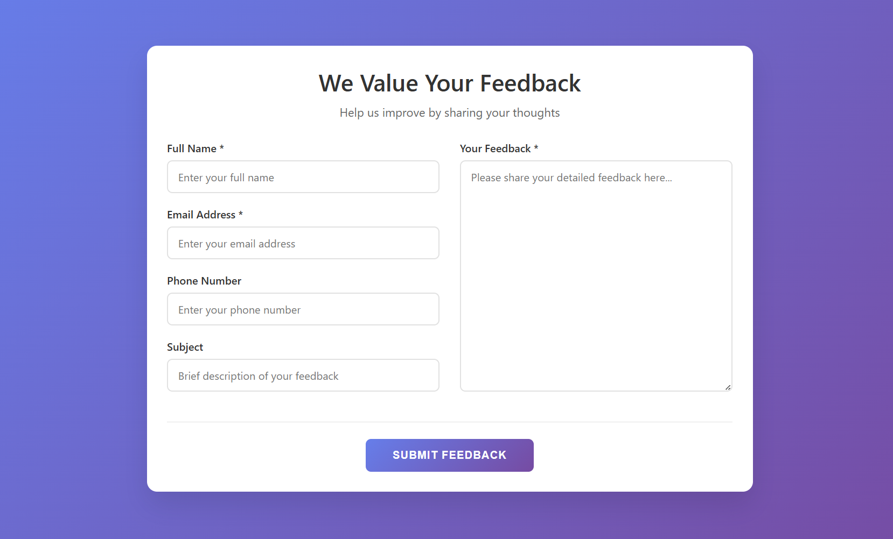
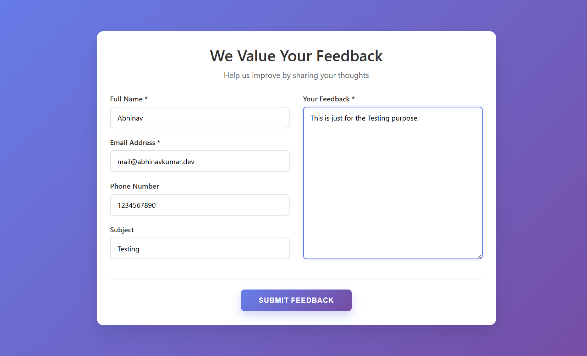
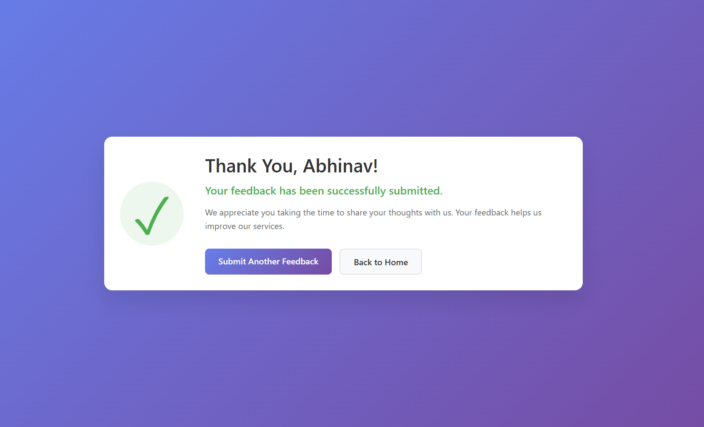
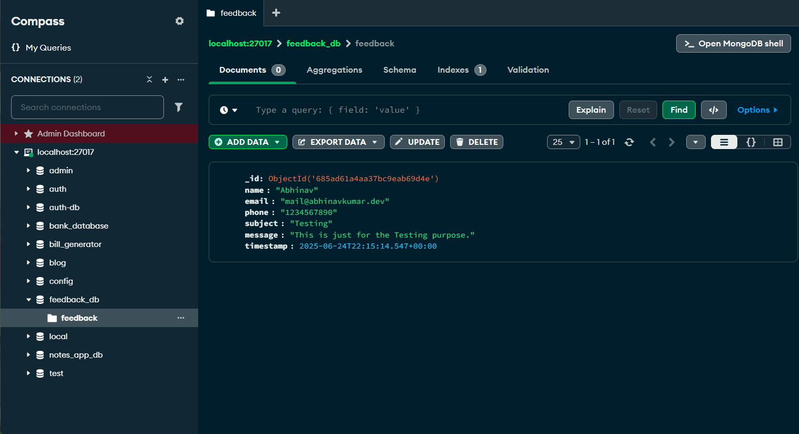

## Overview ✨
A simple web application built with Flask and MongoDB / MySql for collecting and managing user feedback.

## Features 🌟
- Submit feedback through a web form
- Store feedback data in MongoDB
- View all submitted feedback
- Environment variable configuration
- Form validation and error handling
- Responsive web interface

## Screenshots 🖼️

### ➡️ Form

### ➡️ Form Filling & Response

### ➡️ MongoDB Cursor

